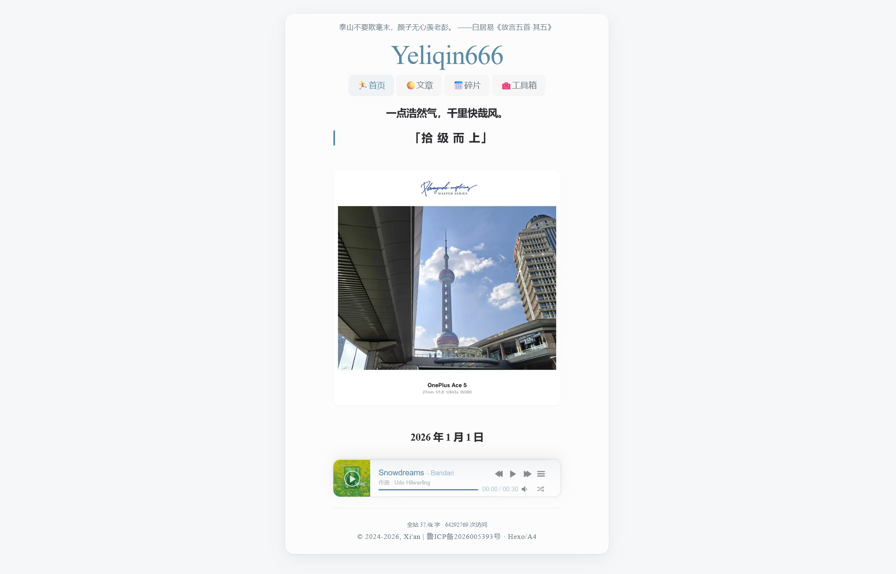
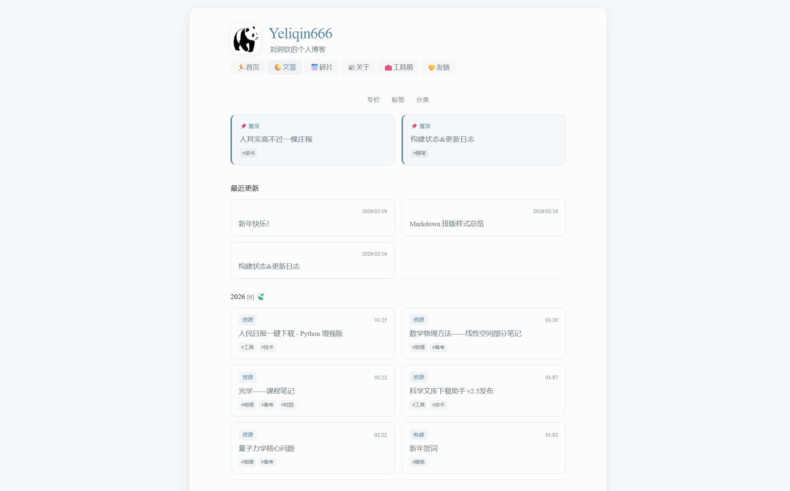
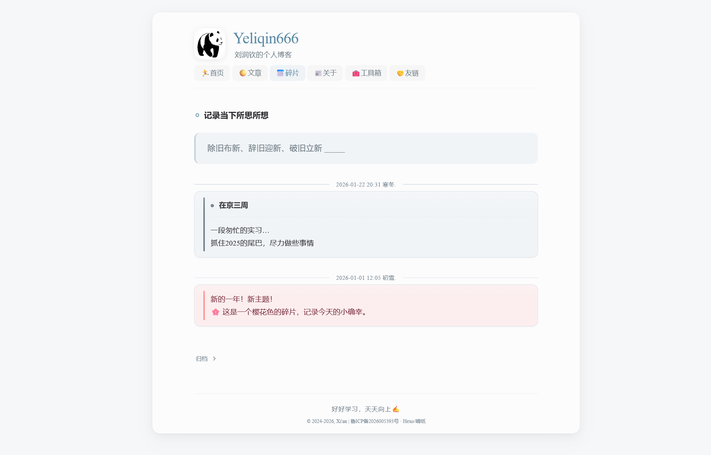
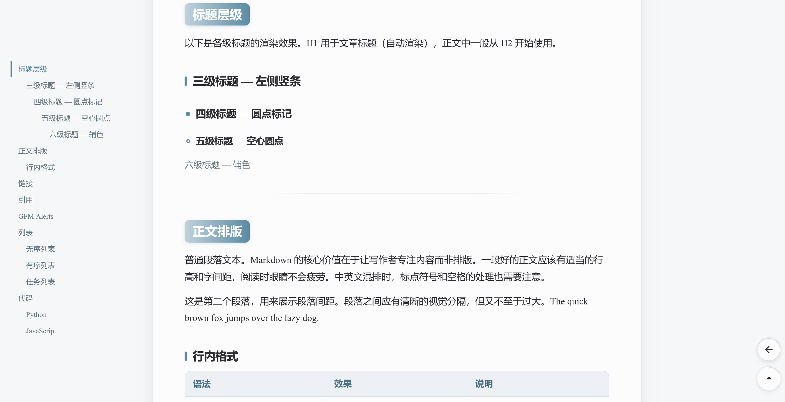

# Hexo Theme 晴纸

<div align="center">


**HyperOS 3 设计语言 · 霁蓝色调 · 纸张美学**

基于 [A4 v2.0.0](https://github.com/HiNinoJay/hexo-theme-A4) 深度重构。

[在线预览](https://www.runqinliu666.cn) · [原主题仓库](https://github.com/HiNinoJay/hexo-theme-A4)

</div>

---

## 预览

<div align="center">



 



</div>

---

## 设计

晴纸 v3 的色彩中心是「霁蓝」——一种沉静的钢蓝色（`#5B8BA4`），它出现在链接、按钮、标题标记和所有交互强调处。所有颜色以 CSS Custom Properties 形式暴露，Canvas 绘图也通过 `getComputedStyle` 读取同一套 Token，视觉上保持一致。

字体使用 **MiSans**（小米 HyperOS 系统字体），三个字重通过 jsDelivr CDN 子集化加载。链接悬停时出现马克笔划线，删除线用 SVG 波浪线手绘风格替代。

文章排版风格移植自 Typora 主题 **[Phycat](https://github.com/sumruler/typora-theme-phycat)**（Copyright © 2024 徐继龙，MIT），并重新适配霁蓝 Token 体系。标题按层级分别是：H1 居中 + 渐变细条、H2 渐变胶囊标签、H3 左侧竖条、H4 实心圆点、H5 空心圆点。每一级别都有 hover 动效。行内 `mark` 像荧光笔一样从底部浮起，`kbd` 是 3D 键帽，`strong` 带主题色深色点缀。

---

## 技术

**零 jQuery**。6 个核心 JS 文件用 `IntersectionObserver` / `fetch` / `scrollIntoView` 重写。

**CSS**：`style.css` 定义全局 Token 和纸面布局，`modules.css` 包含 8 个按注释分节的功能模块（卡片、便签、马克笔、专栏、关于页 Todo、标签/分类子页等）。主题配置（颜色、字体、宽度、背景图）通过 `_partial/configcss/` 中的 4 个 EJS 模板在 `<head>` 内注入 CSS 变量覆盖，不需要改 CSS 文件本身。

**公式**：`hexo-renderer-pandoc` + `hexo-filter-mathjax` 服务端渲染，主题自身不加载客户端 MathJax。

**⚠️ CDN 必须关闭**（`cdn.enable: false`）：CDN 上托管的是旧版 jQuery 脚本，开启会与原生 JS 冲突。

**工具箱**：42 个纯前端工具（学术/校园/音乐/开发/效率/极客），每个是一个自描述 JS 对象，放入 `layout/_partial/tools/*.ejs` 后自动扫描注册：

```javascript
{id:'plotter', name:'函数绘图', icon:'📈', cat:'academic', desc:'高清 · 三种坐标 · 多参数',
html(){ return '<div>...</div>' },
init(el){ /* 初始化 */ }}
```

共享 API：`loadJS` / `loadCSS` / `loadMath` / `loadKaTeX` / `tex` / `texD`。

---

## 功能

**专栏系统**：文章 front-matter 写 `series` + `series_index`，主题脚本自动生成 `/series/` 总览页和各专栏详情页。文章页内出现带荧光标注当前篇的专栏导航条。可选 `series_slug`（自定义 URL）、`series_color`、`series_icon`。

**Fragment 便签**：6 种颜色（red / yellow / green / blue / purple / grey），支持单回车换行：

```markdown

内容

```

同文件还注册了行内圆形色块标签：`重要`。

**PDF 嵌入**：`` — 桌面端 `<embed>` 内嵌预览，移动端自动转为下载链接。

**图片灯箱**：文章内所有 `` 由 post-render 过滤器自动包裹为 LightGallery 灯箱链接，并注入 `loading="lazy"`。如需跳过某张图，加 `data-no-gallery` 属性即可。

**最近更新**：`/recent-updates/` 由主题脚本自动生成。判定规则严格——只有 front-matter 中亲手写了 `updated:` 字段的文章才进入列表，Git 时间戳和系统时间完全过滤。

**UI 工具**：回到顶部（SVG 圆弧进度指示器）、返回上一页（浏览位置记忆）、顶部折叠目录、宽屏浮动目录，均可在 `tool.*` 独立关闭。

**音乐播放器**：MetingJS + APlayer 悬浮在首页右下角，支持多源 API 容灾切换。

**评论**：支持 Waline（深度定制霁蓝样式）/ Giscus / Twikoo / Artalk，有 `lazyLoad` 懒加载选项。

**每日一句**：`jinrishici`（今日诗词）/ `hitokoto`（一言）/ `custom` + 兜底文本，三选一。

**SEO**：Open Graph / Twitter Card / Canonical / RSS / robots.txt / sitemap.xml 全部内置。

---

## 快速开始

### 前置要求
- Node.js ≥ 18，Hexo ≥ 8，Pandoc（本地安装）

### 安装

```bash
cd your-hexo-site
git clone https://github.com/yeliqin666/hexo-theme-qingzhi themes/qingzhi
npm install --save hexo-wordcount hexo-generator-search hexo-renderer-pandoc hexo-filter-mathjax
```

站点 `_config.yml` 设置 `theme: qingzhi`。

### 主题配置

`themes/qingzhi/_config.yml` 共 11 个功能区块，每块均有行内注释。最常用的修改点：

- `menu` / `showInMenu` — 导航栏；`showInMenu` 控制哪些项在首页显示为可点链接
- `index.width` / `post.width` — 纸面宽度（small / middle / big）
- `comment` — 评论系统选型
- `aplayer` — 音乐播放器（以网易云为例）：打开歌单页面，把 URL 里的数字填进 `id`。因官方 Meting API 已不稳定，建议配上自定义 `customApi` 及 `customApiFallbacks` 兜底：
  ```yaml
  aplayer:
    enable: true
    server: netease      # netease | tencent | kugou
    type: playlist       # playlist | album | song
    id: '472143089'      # 歌单 URL 中的数字
    customApi: 'https://meting.qjqq.cn/?server=:server&type=:type&id=:id'
    customApiFallbacks:
      - 'https://api.injahow.cn/meting/?server=:server&type=:type&id=:id&r=:r'
  ```
- `tool.*` — UI 功能按需关闭
- `inject.css` — 额外 CSS 文件注入钩子

```bash
hexo clean && hexo g && hexo s
```

---

## 致谢

- **原主题**：[Nino](https://github.com/HiNinoJay) — [hexo-theme-A4](https://github.com/HiNinoJay/hexo-theme-A4) v2.0.0（MIT）
- **Markdown 排版**：[sumruler](https://github.com/sumruler) — [typora-theme-phycat](https://github.com/sumruler/typora-theme-phycat)（MIT，移植适配）
- **字体**：[MiSans](https://hyperos.mi.com/font) — 小米 HyperOS 系统字体
- **评论**：[Waline](https://waline.js.org/) / [Giscus](https://giscus.app/)
- **灯箱**：[LightGallery](https://www.lightgalleryjs.com/)（GPLv3）
- **播放器**：[APlayer](https://aplayer.js.org/) / [MetingJS](https://github.com/metowolf/MetingJS)
- **CDN**：[jsDelivr](https://www.jsdelivr.com/) / [KaTeX](https://katex.org/) / [math.js](https://mathjs.org/)

---

## License

[MIT](LICENSE)（主题自身代码）。第三方依赖 LightGallery 为 GPLv3，详见 [LICENSE](LICENSE)。
